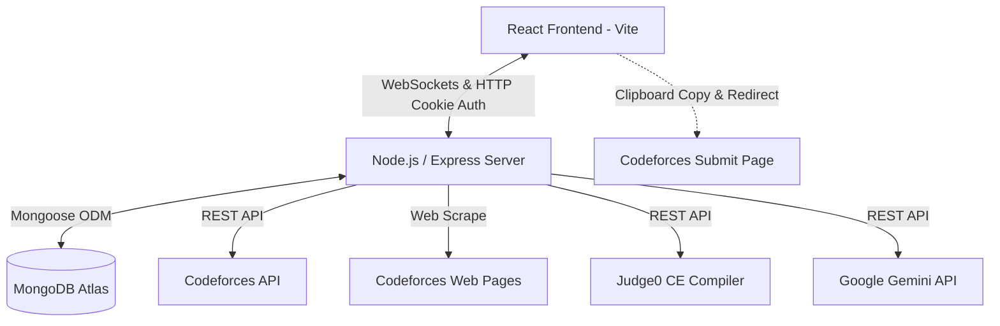
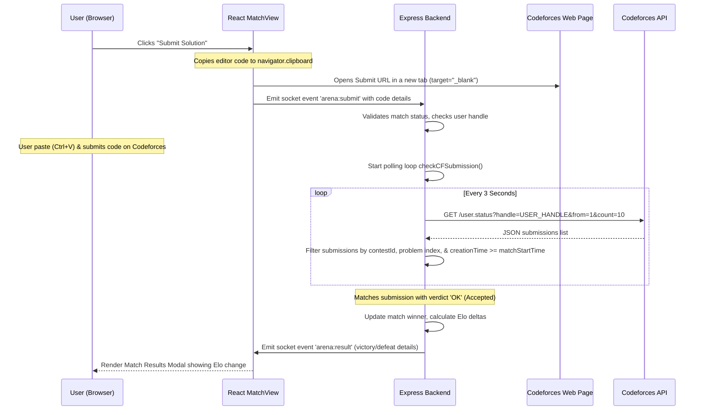
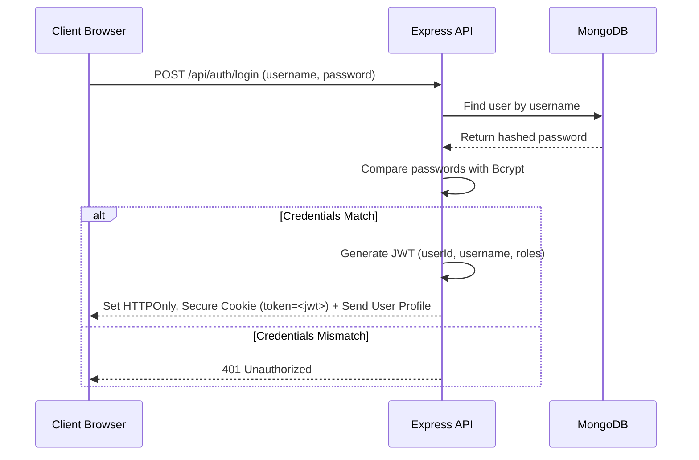
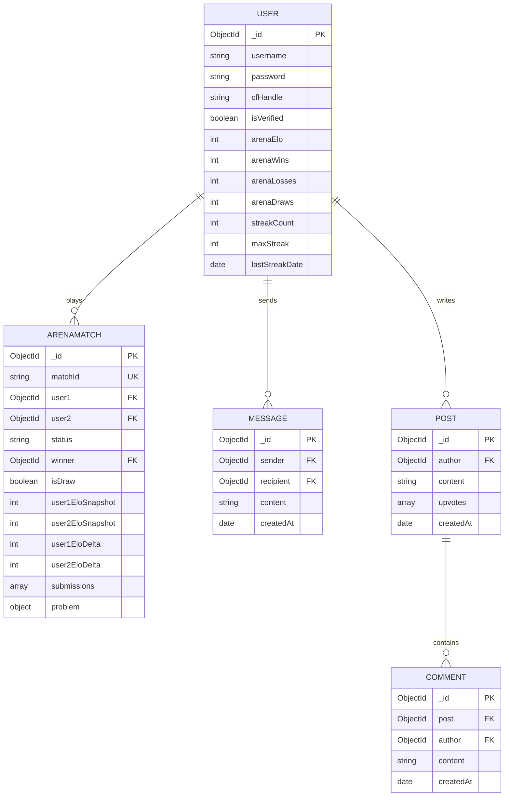

# RankUp Interview Preparation & Comprehensive Architecture Guide

This document is a professional-grade technical reference manual and interview preparation guide for **RankUp**, a real-time gamified practicing and social platform designed for competitive programming enthusiasts. This guide is structured to help you explain the **entire** project codebase and architecture confidently during software engineering interviews (internships, placements, and senior roles), detailing the work of the team as well as your own contributions.

---

# 1. Project Overview

### Project Name
*   **RankUp** ⚡ (Live Site: [rankup-zvji.onrender.com](https://rankup-zvji.onrender.com/))

### Problem Statement
Competitive programmers often practice in isolation, solving static problems from online judges (e.g., Codeforces, LeetCode, CodeChef) without real-time peer feedback, pacing pressure, or immediate collaborative support. Existing platforms lack native real-time peer-to-peer lockout duels, localized contest messaging, and progressive, spoiler-free AI-assisted tutoring.

### Motivation
To transform solitary coding practice into a highly interactive, community-driven social and competitive ecosystem. By combining social feeds, direct messaging, campus CP "Wing" management, real-time 1v1 lockout matching, and progressive AI hints, RankUp aims to maximize practicing consistency and peer accountability.

### Real-world Need
Gamification and collaborative practice have been proven to significantly boost coding practice consistency. CodeArena's 1v1 lockout format mimics actual technical screening rounds where speed, accuracy, and working under pressure are crucial.

### Target Users
*   Competitive programmers preparing for contests.
*   University computer science clubs and campus CP wings organizing training sessions.
*   Students preparing for coding rounds in tech recruitment.

### Key Features
1.  **CodeArena**: Real-time 1v1 lockout battles. Auto-matches users within $\pm 200$ Elo, scrapes problem text, formats equations, copies solution code to the user's clipboard, redirects them to Codeforces to submit, and polls Codeforces API to declare the winner.
2.  **Code Playground**: An isolated compiler sandbox utilizing the Judge0 API for running custom test cases before submitting.
3.  **AI Hint Editorials**: Progressive, non-spoiling hint systems driven by the Google Gemini API.
4.  **Social Discussion Hub**: Markdown/LaTeX supported feed where users post, comment, follow peers, and manage reputation (Karma).
5.  **Contest Tracker & Live Chat**: Centralized hub pulling upcoming contests and spawning temporary socket rooms for live discussion.
6.  **CP Wing Verification**: Verification workflows for campus wings to moderate local rankings.

### Business Value
Reduces the overhead of organizing internal practice contests. Encourages daily practice streaks, generating rich metrics (Elo rating, accuracy, streak status) that form a localized, verifiable talent pipeline for recruiter matching.

### Technical Value
Demonstrates expertise in bidirectional socket states, session-safe cookie-based JWT authorization, HTML parsing/scraping under CORS, external API integrations, rating math, and browser-to-native clipboard flows.

---

# 2. Executive Summary

Use these structured explanations to pitch this project during interviews depending on the available time.

### 1-Minute Pitch (The Elevator Pitch)
> "RankUp is a gamified social practicing platform for competitive programmers. It addresses solitary practicing fatigue by integrating a real-time 1v1 lockout duel system called **CodeArena**. I designed and built the CodeArena module, which matches players using Socket.IO based on their Elo rating, scrapes Codeforces problem details on the fly, and automatically verifies solutions against the Codeforces API. To bypass bot security filters, the client copies the code to the clipboard and redirects the player to submit, while our backend polls the user status API in real-time to compute rating updates. The project demonstrates real-time state synchronization, scraper building, and external API polling."

### 3-Minute Explanation (Focusing on Operations & Tech Stack)
> "RankUp is a React and Node.js-based single-page application designed to gamify competitive programming. While the team worked on social feeds, contests tracking, and the reputation system, my core focus was the **CodeArena** matching engine.
> 
> When a user enters the Arena, they join an in-memory WebSocket queue. My matching algorithm pairs users who are within $\pm 200$ Elo points of each other. Once a match starts, the server randomly picks a Codeforces problem matching their rating. Because Codeforces blocks iframe embeds using strict CSP policies, I built a backend scraper using Axios and Cheerio to retrieve the problem HTML, which is then rendered on the client with MathJax for LaTeX formatting.
> 
> To handle code execution, I integrated Judge0 for local compilation. For final submissions, Codeforces’ Cloudflare protection blocks automated headless browsers. I solved this by designing a copy-and-redirect workflow: clicking 'Submit' copies the editor's code to the clipboard and opens the Codeforces submit page in a new tab. In the background, the server polls the Codeforces status API. Once a submission with the `OK` (Accepted) verdict is verified, the match is marked as finished, Elo ratings are updated using the standard FIDE rating formula, and updates are pushed via sockets."

### 5-Minute Explanation (Deep Architectural Breakdown)
> "RankUp is a full-stack web application built on the MERN stack with Socket.IO for real-time synchronization. In interviews, I focus on the **CodeArena** module, which I architected from scratch.
> 
> The system has three main architectural flows:
> 1. **Matchmaking Queue**: Users join a queue managed by an in-memory Javascript Map on our Express server. The server runs checks to match users with similar ratings. We use a private Socket.IO channel for each user. Once matched, the server queries the Codeforces API to get the problem set, filters it for the appropriate difficulty level, and returns the metadata.
> 2. **Content Scraping**: Codeforces prevents iframes, so our backend acts as a scraper proxy. It fetches the problem page and parses elements like description, input/output limits, and sample test cases using Cheerio. This scraped data is sent to the client and rendered dynamically. Sample test cases are parsed so that users can run them directly in the browser editor against a Judge0 API instance.
> 3. **Secure Verification**: Submitting solutions programmatically to Codeforces is blocked by anti-bot measures. I implemented a solution where the client copies the code using the Web Clipboard API and opens the Codeforces submit page. Simultaneously, a socket event `arena:submit` triggers a backend polling loop. The backend queries `https://codeforces.com/api/user.status?handle=<cfHandle>&from=1&count=10` every 3 seconds. The server checks that the submission's problem ID matches, the handle is verified, and the submission time is after the match start time.
> 
> If the submission is accepted, the backend calculates the Elo rating change using a FIDE Elo formula with $K=32$. It updates the user documents in MongoDB, updates the match status, and pushes the final results to both players over WebSockets. This design ensures accuracy and prevents users from cheating."

---

# 3. Complete System Architecture

RankUp is built on a decoupled, three-tier architecture utilizing React for the presentation layer, Express/Node.js for the business logic layer, and MongoDB Atlas for the persistence layer, integrated with WebSockets (Socket.IO) for real-time communication.

### High-Level System Architecture Diagram


### Component Diagram
```mermaid
graph TD
    subgraph Client Application (SPA)
        Router[React Router]
        AuthCheck[Auth Wrapper]
        ArenaPage[ArenaPage Lobby]
        MatchView[MatchView Component]
        CodeEditor[CodeEditor Component]
        Playground[Playground Sandbox Page]
        MathJaxEngine[MathJax Parser]
    end

    subgraph Server Application (Node.js)
        ExpressApp[Express API Gateway]
        AuthMid[JWT Cookie Verification]
        SocketManager[Socket.IO Event Coordinator]
        Matchmaker[In-Memory Queue Engine]
        CFScraper[Axios/Cheerio Scraper]
        RatingEngine[Elo Rating Math Engine]
        CFStatusPoll[Codeforces API Poller]
    end

    subgraph Database (MongoDB)
        Users[(User Schema)]
        Matches[(ArenaMatch Schema)]
        DMs[(Message Schema)]
    end

    Router --> AuthCheck
    AuthCheck --> ArenaPage
    ArenaPage --> MatchView
    MatchView --> CodeEditor
    MatchView --> MathJaxEngine
    ExpressApp --> AuthMid
    SocketManager --> Matchmaker
    Matchmaker --> CFScraper
    CFStatusPoll --> RatingEngine
    ExpressApp --> Users
    ExpressApp --> Matches
    ExpressApp --> DMs
```

### Data Flow Diagram: Submission & Verdict Polling


### Authentication Flow Diagram


### Database ER Diagram


---

# 4. Technology Stack Deep Dive

### Frontend
*   **React (Vite)**: Selected for its fast single-page app routing, virtual DOM rendering, and hot-module reloading.
    *   *Alternatives Considered*: Next.js (Server-Side Rendering).
    *   *Tradeoffs*: SSR wasn't necessary for an interactive gaming lobby. Using client-side rendering (CSR) allows us to deploy the build assets directly to static CDNs (Vercel) while keeping the server stateless.
*   **Socket.IO Client**: Handles real-time event synchronization (queue updates, match setups, opponent submission notifications, and results).
    *   *Alternatives Considered*: Native WebSockets.
    *   *Tradeoffs*: Native WebSockets require writing custom reconnect, heartbeat, and room management logic. Socket.IO handles these issues automatically, reducing boilerplate.
*   **MathJax**: Used to parse LaTeX mathematical notations in problem descriptions.
    *   *Tradeoffs*: MathJax is a heavy library. To optimize performance, we load it asynchronously from a CDN only when a user accesses a page requiring math typesetting.

### Backend
*   **Node.js & Express**: Provides an asynchronous, non-blocking runtime environment ideal for handling concurrent I/O operations from WebSocket connections.
    *   *Alternatives Considered*: Django (Python) or Spring Boot (Java).
    *   *Tradeoffs*: Django and Spring Boot are heavier and require multi-threading or external task runners (Celery) to handle long-running WebSocket connections. Node's single-threaded event loop handles thousands of concurrent WebSocket connections efficiently.
*   **Socket.IO Server**: Manages WebSocket connections and divides matched players into private rooms.
*   **Axios & Cheerio**: Axios performs HTTP requests to fetch Codeforces HTML pages, and Cheerio loads and queries the DOM server-side.
    *   *Alternatives Considered*: Puppeteer.
    *   *Tradeoffs*: Puppeteer launches a headless Chromium instance, which is resource-intensive. Cheerio is a fast, lightweight parser that runs directly in Node memory, making it much more suitable for server-side scraping.

### Database
*   **MongoDB Atlas**: A document-oriented NoSQL database that stores matches as self-contained documents.
    *   *Alternatives Considered*: PostgreSQL.
    *   *Tradeoffs*: Matches contain dynamic data, including nested lists of submissions. In PostgreSQL, this would require joining tables (Matches, Submissions, Problems). In MongoDB, the entire match state is retrieved in a single query by indexing the `matchId`.

### Deployment & Tooling
*   **Bcrypt**: Used for secure, one-way password hashing.
*   **JWT (`jsonwebtoken`)**: Generates stateless session tokens stored in HttpOnly cookies, protecting the system from CSRF and XSS attacks.
*   **Render & Vercel**: Vercel hosts the static frontend assets, and Render runs the Node.js service.

---

# 5. Folder Structure Analysis

```
rankup/
├── backend/                    # Node.js backend application
│   ├── controllers/            # Controller layer separating business logic from routes
│   │   ├── arenaController.js  # Manages match history, leaderboard, and Judge0 code execution
│   │   ├── authController.js   # Handles registration, login, and token generation
│   │   ├── chatController.js   # Handles conversation aggregation and message logs
│   │   ├── commentController.js# Handles forum and editorial nested comments
│   │   ├── contestController.js# Handles contest schedules and linked post references
│   │   ├── postController.js   # Wrote discussion postings, upvotes, and reputation counts
│   │   └── verifyController.js # Integrates Codeforces handle verification using compile errors
│   ├── jobs/                   # Automated background cron jobs
│   │   └── syncCfRatings.js    # Synchronizes user ratings with the Codeforces API
│   ├── middleware/             # Express middlewares
│   │   └── auth.js             # Verifies JWTs and attaches user payload
│   ├── models/                 # Mongoose models defining MongoDB collections
│   │   ├── ArenaMatch.js       # Model for CodeArena matches and submissions
│   │   ├── Comment.js          # Model for discussion thread comments
│   │   ├── Contest.js          # Model for contest data sheets and references
│   │   ├── Message.js          # Model for direct chat messages
│   │   ├── Notification.js     # Model for user mentions, follows, and announcements
│   │   └── User.js             # Model for user profiles, credentials, and Elo ratings
│   ├── routes/                 # Express routes mapping HTTP endpoints to controllers
│   │   ├── aiEditorials.js     # Generates progressive editorial hints using Gemini API
│   │   ├── arena.js            # Routes for leaderboards, histories, and execution
│   │   └── auth.js             # Routes for login and authentication
│   ├── utils/                  # Shared helper files
│   ├── .env                    # Local environment secrets (ignored by Git)
│   └── server.js               # Entrypoint: initializes HTTP/WebSocket server, queue, and polling
└── frontend/                   # React frontend application
    ├── public/                 # Static assets
    └── src/
        ├── components/
        │   └── arena/          # UI components for CodeArena
        │       ├── CodeEditor.jsx # Code editor, language selector, and terminal
        │       └── MatchView.jsx  # Main match screen containing scraped problem statement and timer
        ├── pages/              # Primary SPA pages
        │   ├── ArenaPage.jsx   # Matchmaking lobby, queue manager, and leaderboard
        │   ├── HubPage.jsx     # Main social media discussions feed page
        │   ├── MessagesPage.jsx# Live chat conversations dashboard
        │   ├── PlaygroundPage.jsx # Sandbox code playground
        │   └── VerifyPage.jsx  # Codeforces handle verification wizard
        ├── App.jsx             # React application entrypoint and router
        └── main.jsx            # Mounts the React app to the DOM
```

### Folder Architecture & Interaction
*   The system uses the **Controller-Service-Model** design pattern. Routes in `routes/` define the API endpoints and forward requests through the `auth.js` middleware.
*   Controllers in `controllers/` implement the business logic and read/write to Mongoose models in `models/`.
*   `backend/server.js` manages both Express and the Socket.IO instance. When a socket connection is established, it attaches event listeners that communicate directly with the MongoDB model layer.

---

# 6. Database Design

### User Collection (`models/User.js`)
*   **Purpose**: Manages user credentials, verified Codeforces handles, and ranking metrics.
*   **Indexes**:
    *   `username` (Unique, ascending)
    *   `email` (Unique, sparse, ascending)
    *   `googleId` (Unique, sparse, ascending)
*   **Key Constraints**:
    *   `cfHandle` is unique when verified to prevent multiple accounts from linking to the same Codeforces handle.

### ArenaMatch Collection (`models/ArenaMatch.js`)
*   **Purpose**: Records details of every 1v1 match, including problems, snapshot scores, and submissions.
*   **Indexes**:
    *   `matchId` (Unique, indexing: true)
*   **Schema Details**:
    *   `submissions` contains nested `submissionSchema` documents, storing the code, language, and execution results for every compile or submission attempt.

### Post Collection (`models/Post.js`)
*   **Purpose**: Stores discussion feed postings, announcements, and Wing Editorials.
*   **Indexes**:
    *   `author` index for fast profile feed rendering.
*   **Fields**:
    *   `isEditorial` (Boolean): Identifies if the post is a CP Wing Editorial.
    *   `hints` (Array of Strings): Contains collapsible, progressive hints.
    *   `solution` (String): Contains solution code and markdown walkthroughs.

### Message Collection (`models/Message.js`)
*   **Purpose**: Stores direct messages exchanged between users.
*   **Indexes**:
    *   `[sender, recipient]` compound index for fast chat history retrieval.

---

# 7. API Documentation

### 1. Execute Sandbox Code
*   **Route**: `POST /api/arena/execute`
*   **Authentication**: Required (JWT cookie verified by `requireAuth` middleware).
*   **Request Body**:
    ```json
    {
      "source_code": "print('hello')",
      "language_id": 71,
      "stdin": "input_data"
    }
    ```
*   **Response (200 OK)**:
    ```json
    {
      "stdout": "hello",
      "time": "0.05",
      "memory": 2048,
      "stderr": null,
      "status": {
        "id": 3,
        "description": "Accepted"
      }
    }
    ```

### 2. Generate AI Progressive Hints
*   **Route**: `POST /api/ai-editorials/generate-hints`
*   **Authentication**: Required (JWT cookie verified by `requireAuth` middleware).
*   **Request Body**:
    ```json
    {
      "problemUrl": "https://codeforces.com/problemset/problem/1/A",
      "apiKey": "gemini_api_key"
    }
    ```
*   **Response (200 OK)**:
    ```json
    {
      "directionToThink": "Focus on mathematical divisions and scaling math values.",
      "hints": [
        { "hint": "Consider the size of the square flagstones compared to the total grid.", "catch": "Do not use float divisions." }
      ],
      "editorial": [
        { "title": "Approach", "content": "Calculate the ceiling division of the width and height." }
      ],
      "solutionCode": "...",
      "solutionExplanation": "Short explanation of how the code works."
    }
    ```

### 3. Verify Codeforces Handle
*   **Route**: `POST /api/verify/handle`
*   **Authentication**: Required.
*   **Request Body**:
    ```json
    {
      "username": " Surendra_vishnoi",
      "cfHandle": "Surendra_vishnoi"
    }
    ```
*   **Response (200 OK)**:
    ```json
    {
      "message": "Account verified successfully!",
      "isVerified": true,
      "profile": { "rating": 1500, "rank": "specialist", "cfHandle": "Surendra_vishnoi" }
    }
    ```

---

# 8. Authentication & Authorization

RankUp implements a stateless, token-based authentication flow.

### Detailed JWT Auth Flow
1.  **Registration/Login**: The user sends their credentials to `POST /api/auth/login`.
2.  **Token Generation**: The server compares the password using `bcrypt.compare`. If correct, it generates a JWT containing the user's ID, username, and role.
3.  **Secure Cookie Storage**: The JWT is returned in a `Set-Cookie` header:
    ```http
    Set-Cookie: token=<jwt>; HttpOnly; Secure; SameSite=Lax; Max-Age=2592000
    ```
    *   `HttpOnly` prevents client-side Javascript from reading the token, mitigating XSS token theft.
    *   `Secure` ensures the cookie is only sent over HTTPS.
    *   `SameSite=Lax` helps protect against Cross-Site Request Forgery (CSRF).
4.  **Authorization**: For protected routes, the `requireAuth` middleware reads the cookie, decodes the token using `jwt.verify`, and attaches the user object to the request.
5.  **WebSocket Handshake**: Socket.IO parses the `Cookie` header during the connection handshake. If the token is invalid, the connection is rejected.

---

# 9. Core Project Modules Deep Dive

## 1. CodeArena Module (Lockout Duels & Socket Matchmaking)
*   **Problem It Solves**: Solitary practice lacks the pacing pressure of live contests. CodeArena introduces real-time 1v1 lockout duels to make practice more engaging.
*   **Matchmaking Loop**: The server manages an in-memory queue of players. It matches users whose Elo rating is within $\pm 200$ points.
*   **Content Scraping**: Codeforces blocks iframe embeds. To work around this, the backend scrapes the problem statement and sample test cases using Axios and Cheerio. The scraped HTML is rendered on the client, and math formulas are formatted using MathJax.
*   **Submission Flow**: Clicking "Submit" copies the code to the user's clipboard and opens the Codeforces submit page in a new tab. In the background, the server polls the Codeforces status API every 3 seconds to check for new submissions under the user's handle. Once an `OK` (Accepted) verdict is verified, the server updates both players' Elo ratings and pushes the final match results via sockets.

## 2. Wing Editorials & AI Hints Module
*   **Problem It Solves**: Textbooks and online solutions often reveal too much information too quickly, spoiling the problem-solving experience for students.
*   **Scraper & AI Integration**: 
    1. The backend scrapes the Codeforces problem tutorial page using a `curl` shell call inside a Node worker.
    2. Cheerio extracts the main blog text content from the `.ttypography` container.
    3. The scraped text is sent to the Google Gemini API with a prompt to find the explanation for the specific problem ID.
    4. The model returns a structured JSON payload containing a direction to think, progressive hints with common pitfalls ("catches"), observation steps, and a clean C++ solution.
*   **Client Rendering**: The client displays hints one by one as collapsible cards, allowing users to unlock hints progressively without exposing the final solution.

## 3. Social Hub & Reputation Engine
*   **Problem It Solves**: Traditional forums lack moderation tools and gamified incentive loops that reward helpful users.
*   **Karma Calculations**: 
    *   Creating a standard discussion post gives the author $+3$ Karma points.
    *   Authoring a verified CP Wing Editorial gives the author $+5$ Karma points.
    *   When another user upvotes a post, the author gets $+1$ Karma point. Upvote toggles deduct $-1$ Karma point.
*   **Notification Engine**: 
    *   Announcements created by admins trigger system-wide notifications for all users.
    *   Mentions (e.g. `@Surendra_vishnoi`) are extracted from post markdown text using a regex parser and trigger target notifications.

## 4. Live Codeforces Sync Job
*   **Problem It Solves**: Storing stale ratings and ranks in user profiles makes leaderboards inaccurate.
*   **Cron Synchronization**: 
    1. A daily background cron job runs at 03:00 IST using `node-cron`.
    2. The worker retrieves all verified user handles from the database.
    3. It batches handles in chunks of 300 to respect Codeforces API constraints.
    4. It fetches profile info from `https://codeforces.com/api/user.info` and compares ratings.
    5. It performs a high-performance `bulkWrite` operation to update MongoDB in a single database roundtrip.
    6. It waits 1.2 seconds between batches to respect rate limits.

## 5. Account Handle Verification Flow
*   **Problem It Solves**: Users could link arbitrary high-ranked Codeforces handles to their account to cheat the leaderboard system.
*   **Verification Challenge**:
    1. The wizard asks the user to submit a code block that triggers a compilation error on a specific problem (e.g., Codeforces Problem 1A) within 5 minutes.
    2. Clicking "Verify" triggers the backend to query `https://codeforces.com/api/user.status?handle=<handle>&from=1&count=5`.
    3. The server checks for a `COMPILATION_ERROR` verdict with a timestamp matching the last 5 minutes.
    4. Once verified, the handle is locked to the user profile, and their rating and rank are synced.

## 6. Real-time DMs & Contest Chat Rooms
*   **Problem It Solves**: Users need a way to communicate and coordinate matches directly on the platform.
*   **Aggregation Pipelines**: Conversations are retrieved using a MongoDB aggregation pipeline that groups messages by the other participant, calculates unread counts, and returns user details.
*   **Contest Sockets**: When a contest goes live, the server spawns a temporary Socket.IO chat room using the contest ID, allowing users to discuss problems in real-time.

---

# 10. Security Analysis

*   **XSS Mitigation**: The frontend renders scraped HTML from Codeforces using `dangerouslySetInnerHTML`. Because the source is a trusted domain, the risk of injection is minimized. However, as an additional security measure, the scraper only extracts specific, predefined elements from the Codeforces DOM.
*   **SQL/NoSQL Injection**: We use Mongoose schemas to query MongoDB. Queries utilize structured objects (e.g., `User.findOne({ username })`) which automatically sanitize input parameters, preventing query selector injection.
*   **CSRF Prevention**: User authentication tokens are stored in `HttpOnly` cookies, which restricts JavaScript from accessing them. Access is validated on request receipt.
*   **Strict Access Control**: Protect routes use middleware that checks the decoded JWT claims for the required role (e.g., `isWingMember` or `isAdmin`) before running controller logic.

---

# 11. Performance Analysis

### Complexity Analysis

| Operation | Time Complexity | Space Complexity | Notes |
| :--- | :--- | :--- | :--- |
| **Matchmaking** | $O(N)$ | $O(N)$ | Loops through the active queue map of size $N$. |
| **Elo Calculation** | $O(1)$ | $O(1)$ | Constant time mathematical calculations. |
| **Codeforces Polling** | $O(1)$ | $O(1)$ | Fetches a fixed list of 10 submissions. |
| **Conversation List Aggregation** | $O(M \log C)$ | $O(C)$ | Aggregates $M$ messages into $C$ conversations. |
| **Daily Cron Sync** | $O(U/300)$ | $O(U)$ | Bulk writes $U$ user profiles in batches of 300. |

### Bottlenecks and Optimizations
*   *Aggregation Pipeline*: Querying direct messages on every page refresh can slow down the database. To optimize this, we index the `[sender, recipient]` fields in the Message collection.
*   *Scraper Performance*: Scraping problem descriptions dynamically for every match can introduce latency. To optimize this, the backend caches problem set metadata in memory for 1 hour.

---

# 12. Design Patterns Used

*   **Observer Pattern**: Implemented using Socket.IO. The server acts as the subject, broadcasting match events (`arena:match_found`, `arena:result`) to client observers in private rooms.
*   **Proxy Pattern**: The backend acts as a proxy for the Judge0 compiler API, keeping the API keys secure on the server instead of exposing them to the client.
*   **MVC Pattern**: Express routes act as the controller mapping, calling decoupled controller functions, and reading/writing to Mongoose models.
*   **Strategy Pattern**: The AI Hints generator uses a fallback strategy, attempting to query models in order of priority (`gemini-2.5-flash` down to `gemini-1.5-flash`) if an instance is overloaded.

---

# 13. Scalability Discussion

### At 100 Users
*   *Bottlenecks*: None. The current single Node.js thread and MongoDB instance handle this without load.

### At 10,000 Users
*   *Bottlenecks*: The in-memory matchmaking queue `arenaQueue` is stored in the Node.js process memory. If the backend scales horizontally (multiple server instances behind a load balancer), the servers cannot share the queue.
*   *Solution*: Migrate the matchmaking queue to a shared **Redis cache** using sorted sets to organize users by Elo.

### At 100,000+ Users
*   *Bottlenecks*: Database write operations and API rate limits on Codeforces.
*   *Solution*: Implement database sharding, index search keys, deploy replica sets, and route API calls through rotating proxies to prevent rate limit blocks.

---

# 14. Deployment Architecture

```
[GitHub Repo] ---> [Vercel (Frontend SPA Build)] ---> Serves static files
              ---> [Render/AWS EC2 (Node.js Server)] ---> Connects to MongoDB Atlas
```

*   **Build Process**: The frontend Vite project is bundled into static HTML/JS assets (`npm run build`) and served via a static hosting provider. The Express backend is deployed as a long-running system service.
*   **Environment Variables**: Secure configuration variables (`JWT_SECRET`, `MONGODB_URI`, `JUDGE0_API_KEY`) are managed strictly through production system environment settings and never committed to version control.

---

# 15. Resume Talking Points

### 1. CodeArena Module (Duels & Matchmaking)
*   Designed and built a real-time 1v1 lockout duel application using React and Socket.IO, matching users within $\pm 200$ Elo and verifying solutions against the Codeforces API.
*   Implemented a clipboard copy-and-redirect workflow on the client to work around Cloudflare protection on the Codeforces submit form.
*   Developed a backend scraper using Axios and Cheerio to bypass frame-blocking policies.

### 2. Wing Editorials & AI Hints Module
*   Built an automated backend scraper that retrieves Codeforces tutorials and parses text using Cheerio.
*   Integrated the Google Gemini API to parse tutorial text and return structured JSON containing progressive hints.
*   Designed a client-side progressive hint component that displays observations and catches sequentially.

### 3. Verification & Cron Sync Engine
*   Created a password-less verification system that checks for recent compilation errors on Codeforces to confirm handle ownership.
*   Designed a daily background sync job using `node-cron` that fetches profile updates from the Codeforces API.
*   Optimized database updates using high-performance MongoDB `bulkWrite` operations.

### 4. Direct Messaging & Aggregation
*   Built a real-time direct messaging system using Socket.IO to handle messaging and online status updates.
*   Optimized conversation listing queries using MongoDB aggregation pipelines.
*   Designed temporary chat rooms for contests using Socket.IO rooms.

---

# 16. Interview Questions and Answers

## Project Overview Questions

### Q1: What is the main problem RankUp solves?
*   **Interviewer Intention**: Understand if you can explain the core value of the project.
*   **Ideal Answer**: Solitary competitive programming practicing can lead to fatigue. RankUp gamifies practice by providing a 1v1 lockout duel environment where players compete in real-time.
*   **Follow-ups**: What features encourage users to return? (Daily streaks, leaderboards).

### Q2: Who are the target users?
*   **Ideal Answer**: Students preparing for technical interviews, competitive programming enthusiasts, and university computer science clubs.

### Q3: How is this platform different from Codeforces?
*   **Ideal Answer**: Codeforces hosts large scheduled contests. RankUp provides instant 1v1 matchups, progressive AI hints, and localized campus wing boards.

### Q4: What is a CP Wing?
*   **Ideal Answer**: A university-specific competitive programming club. Members get verified ranks, local leaderboards, and a dedicated drafting space for editorials.

### Q5: How does the streak system work?
*   **Ideal Answer**: The system updates `streakCount` and `lastActiveAt` in MongoDB when a user completes a practice challenge, resetting the streak if they miss a day.

### Q6: What is the benefit of the Karma system?
*   **Ideal Answer**: It encourages quality discussion. Users earn Karma when their posts or comments are upvoted by peers.

### Q7: What are the main features of the Contest Tracker?
*   **Ideal Answer**: It pulls upcoming contests from Codeforces and provides a temporary chat room for users to discuss the problems during the contest.

### Q8: What was your team's division of labor?
*   **Ideal Answer**: My team members focused on the social feed, contests tracking, and wing moderation. I took full ownership of the CodeArena module, including matchmaking, scraping, code execution, and rating calculations.

---

## Architecture Questions

### Q9: Describe the system's architecture.
*   **Interviewer Intention**: Assess your high-level system design knowledge.
*   **Ideal Answer**: RankUp uses a three-tier architecture: a React client, a Node.js/Express backend, and MongoDB Atlas. We use Socket.IO for real-time matchmaking.
*   **Follow-ups**: Why did you choose this architecture over a serverless model? (WebSocket connections require a persistent server process).

### Q10: How are WebSockets managed on the server?
*   **Ideal Answer**: Socket.IO runs on the same port as our Express app. We use middleware to verify JWTs during the handshake and group users into private rooms.

### Q11: What happens architecturally when a user joins the queue?
*   **Ideal Answer**: The client emits `arena:join_queue`. The server verifies the user's handle and adds their socket ID to an in-memory queue map.

### Q12: How are matches isolated from one another?
*   **Ideal Answer**: When two players are matched, the server assigns them to a private Socket.IO room named `match_[matchId]`. All match events are sent only to that room.

### Q13: How does the system handle server restarts?
*   **Ideal Answer**: Active match states are persisted in MongoDB. If the server restarts, players can rejoin their active match room, and the server queries the database to resume tracking.

### Q14: How are math equations rendered on the client?
*   **Ideal Answer**: We use MathJax. When a scraped problem contains LaTeX delimiters (`$$$`), MathJax parses the text and renders the equations.

### Q15: Why is MongoDB a good choice for this architecture?
*   **Ideal Answer**: Match documents contain dynamic data, including nested lists of submissions. In MongoDB, the entire match state is retrieved in a single query.

### Q16: How does the client communicate auth states to the backend?
*   **Ideal Answer**: The client sends a JWT in an HttpOnly cookie with every request. The backend middleware decodes the token to identify the user.

---

## Frontend Questions

### Q17: Why did you choose Vite over Create React App?
*   **Ideal Answer**: Vite uses native ES modules and leverages esbuild for extremely fast startup and hot-module reloading.

### Q18: How do you prevent layout shift when MathJax renders?
*   **Ideal Answer**: We pre-allocate space in the layout container and display a loading spinner until MathJax finishes rendering the equations.

### Q19: How do you manage the editor state?
*   **Ideal Answer**: We use a controlled React component wrapping a code editor, syncing changes to state, and implementing local storage backups.

### Q20: How does the "Run" feature in the editor work?
*   **Ideal Answer**: The editor sends the code and input to `POST /api/arena/execute`. The backend proxies the request to the Judge0 compiler API and returns the results.

### Q21: How do you ensure the UI is responsive?
*   **Ideal Answer**: We use CSS Flexbox and media queries. On mobile, the layout switches from a side-by-side view to a tabbed interface.

### Q22: How is the timer synchronized between the client and server?
*   **Ideal Answer**: The server sends the match end timestamp (`endTime`). The client calculates the remaining time locally by comparing this timestamp with the local system clock.

### Q23: How do you prevent memory leaks with WebSockets in React?
*   **Ideal Answer**: We register socket event listeners in `useEffect` hooks and return a cleanup function that removes the listeners when the component unmounts.

### Q24: What is the role of `externalStdin` in the editor?
*   **Ideal Answer**: It lets users load sample test cases directly into the execution panel, allowing them to test their code locally with a single click.

---

## Backend Questions

### Q25: How does the Node.js event loop handle long-running API requests?
*   **Interviewer Intention**: Verify understanding of Node's asynchronous model.
*   **Ideal Answer**: Node uses non-blocking I/O. Asynchronous operations, like API calls to Codeforces, are handled by the system kernel or thread pool, allowing the event loop to continue processing other requests.

### Q26: How does the matchmaking algorithm pair users?
*   **Ideal Answer**: The server loops through the in-memory queue map and matches users whose Elo rating is within a $\pm 200$ range of the current user.

### Q27: How are Codeforces problems selected?
*   **Ideal Answer**: The server queries the Codeforces API for a list of problems. It then filters the list based on the average rating of both players and selects one at random.

### Q28: How is the problem cache structured?
*   **Ideal Answer**: The server stores the Codeforces problem set in memory and refreshes it every 1 hour to keep problem metadata up to date without spamming the API.

### Q29: How does the backend scrape problem details?
*   **Ideal Answer**: It uses Axios to fetch the Codeforces problem page and Cheerio to parse the DOM, extracting the description, input/output specifications, and sample test cases.

### Q30: How does the backend prevent scraping duplicate problems?
*   **Ideal Answer**: We cross-reference the problem set with the match history in MongoDB to ensure players are assigned a problem they have not solved recently.

### Q31: How is the FIDE Elo formula implemented?
*   **Ideal Answer**: We calculate expected scores based on the Elo difference between players, then update ratings using a K-factor of 32:
    `delta = Math.round(K * (outcome - expected))`.

### Q32: What happens when a match expires?
*   **Ideal Answer**: A `setTimeout` trigger fires on the server, marking the match status as `finished` and updating both players' ratings based on a draw outcome (0.5).

---

## Database Questions

### Q33: Why did you use MongoDB over a SQL database?
*   **Ideal Answer**: The match document has a flexible schema with nested submission histories. MongoDB's document model matches this structure, allowing us to retrieve the entire match state in a single query.

### Q34: What indexes did you define on the User collection?
*   **Ideal Answer**: We defined unique indexes on `username`, `email`, and `googleId` for fast lookups.

### Q35: What is the purpose of the `sparse` index on `googleId`?
*   **Ideal Answer**: It allows the database to index only the documents that contain a `googleId`, permitting standard email-based sign-ups without unique key collisions.

### Q36: How are match submissions stored?
*   **Ideal Answer**: Submissions are stored as a nested array of subdocuments inside the `ArenaMatch` document.

### Q37: How do you handle schema updates in Mongoose?
*   **Ideal Answer**: We define default values for new fields in our Mongoose schemas. For complex changes, we write migration scripts that run during deployments.

### Q38: How do you optimize query performance for direct messages?
*   **Ideal Answer**: We use a compound index on `[sender, recipient]` to fetch chat histories efficiently.

### Q39: What is the difference between `findOne` and `findById` in Mongoose?
*   **Ideal Answer**: `findById` is a helper that searches specifically by the `_id` field. `findOne` searches by any query filter.

### Q40: How do you handle database transaction safety?
*   **Ideal Answer**: For critical operations like updating user Elo ratings, we use atomic Mongoose operations (like `$inc`) to prevent race conditions.

---

## Authentication Questions

### Q41: Why use HttpOnly cookies instead of LocalStorage?
*   **Interviewer Intention**: Verify security best practices.
*   **Ideal Answer**: LocalStorage is accessible to client-side scripts, making it vulnerable to XSS attacks. HttpOnly cookies cannot be read by Javascript, protecting tokens from theft.

### Q42: What is the structure of a JWT?
*   **Ideal Answer**: A JWT consists of three parts separated by dots: a header, a payload (containing claims like user ID), and a signature.

### Q43: How is the JWT signature verified?
*   **Ideal Answer**: The server decodes the header and payload, hashes them using a secret key, and compares the result to the signature in the token.

### Q44: What happens when a token expires?
*   **Ideal Answer**: The backend middleware rejects the request with a `401 Unauthorized` status. The client then clears the cookie and redirects the user to the login page.

### Q45: How do you implement logout?
*   **Ideal Answer**: The backend clears the cookie by setting its expiration date to the past:
    `res.clearCookie('token')`.

### Q46: How are passwords stored securely?
*   **Ideal Answer**: We hash passwords using Bcrypt with a salt round factor of 10. We never store plain-text passwords.

### Q47: How does the verification system link Codeforces handles?
*   **Ideal Answer**: The platform asks the user to submit a code snippet that triggers a specific compilation error on Codeforces. The backend verifies the error to confirm ownership.

### Q48: How are user roles (Admin, Wing Member) checked?
*   **Ideal Answer**: Roles are stored in the database. Protected routes use middleware that checks the decoded JWT claims for the required role.

---

## API Questions

### Q49: How do you handle errors in Express routes?
*   **Ideal Answer**: We wrap asynchronous controllers in `try-catch` blocks and forward errors to a global error-handling middleware.

### Q50: What is the purpose of the Codeforces API integration?
*   **Ideal Answer**: We query the Codeforces API to sync player ratings and verify submissions during duels.

### Q51: How do you handle Codeforces API rate limits?
*   **Ideal Answer**: We cache problem sets in memory and throttle status polling to 3-second intervals per active user.

### Q52: What is the Judge0 API?
*   **Ideal Answer**: An open-source online code execution engine. We use it to compile and run code in our sandbox environment.

### Q53: How does the backend communicate with Judge0?
*   **Ideal Answer**: The backend sends a POST request with the source code and input parameters, waits for execution, and returns the output.

### Q54: What happens if the Judge0 API is offline?
*   **Ideal Answer**: The server catches the request error and returns a `502 Bad Gateway` status to the client, along with a helpful error message.

### Q55: How do you validate API request payloads?
*   **Ideal Answer**: We use validation libraries (like Joi or express-validator) to check request parameters before running business logic.

### Q56: Why is the backend acting as a proxy for the Judge0 API?
*   **Ideal Answer**: To keep our Judge0 API credentials secure on the server instead of exposing them to the client.

---

## Security Questions

### Q57: How do you protect the system against NoSQL Injection?
*   **Interviewer Intention**: Verify security best practices.
*   **Ideal Answer**: Mongoose schemas enforce type casting on all inputs. We avoid using raw queries like `req.body` directly, preventing query selector injections.

### Q58: How do you mitigate Cross-Site Scripting (XSS) when rendering scraped HTML?
*   **Ideal Answer**: We only scrape problem statements from the trusted Codeforces domain. To further secure the client, we parse the HTML and only render specific elements.

### Q59: How do you prevent Cross-Site Request Forgery (CSRF)?
*   **Ideal Answer**: We set the cookie's `SameSite` attribute to `Lax` or `Strict` and verify custom request headers for state-changing operations.

### Q60: How does the platform handle CORS?
*   **Ideal Answer**: We configure Express CORS middleware to only accept requests from our verified frontend domain.

### Q61: How do you secure environment variables?
*   **Ideal Answer**: We manage variables using `.env` files locally (ignored by Git) and configure them in our production environment settings.

### Q62: Why is storing JWTs in cookies safer than in local storage?
*   **Ideal Answer**: Cookies with the `HttpOnly` and `Secure` attributes are inaccessible to client-side scripts, protecting them from XSS attacks.

### Q63: What secure coding practices did you follow?
*   **Ideal Answer**: We validated all inputs, sanitized data before rendering, used secure password hashing, and enforced strict access control checks on all routes.

### Q64: How did you secure the WebSockets connection?
*   **Ideal Answer**: We verified the user's JWT during the Socket.IO connection handshake and rejected unauthorized socket connections.

---

## Scalability Questions

### Q65: How would you scale the matchmaking queue to support 10,000 concurrent users?
*   **Interviewer Intention**: Evaluate system scaling design skills.
*   **Ideal Answer**: The current in-memory queue cannot scale across multiple servers. I would migrate the queue to a shared Redis cache using sorted sets to organize users by Elo.
*   **Follow-ups**: How would you handle race conditions in Redis? (Using Redis transactions or Lua scripts).

### Q66: How do you handle database write bottlenecks?
*   **Ideal Answer**: We can deploy MongoDB replica sets to distribute reads and use write concern configurations to manage throughput.

### Q67: How do you handle Codeforces API rate limits at scale?
*   **Ideal Answer**: We can route requests through a rotating proxy pool to prevent IP bans.

### Q68: Why use a Redis cache for matchmaking?
*   **Ideal Answer**: Redis is an in-memory store that provides very fast reads and writes, making it ideal for managing real-time queue states across multiple servers.

### Q69: How would you scale the WebSocket server horizontally?
*   **Ideal Answer**: We can run multiple Node.js instances behind a load balancer and use a Redis adapter to synchronize events across servers.

### Q70: How do you optimize static asset delivery?
*   **Ideal Answer**: We build our frontend into static files and deploy them to a global CDN (like Cloudflare or Vercel).

### Q71: How does database indexing help scaling?
*   **Ideal Answer**: It reduces query search times from $O(N)$ table scans to $O(\log N)$ index lookups, keeping response times low as data grows.

### Q72: How would you handle a sudden surge in traffic?
*   **Ideal Answer**: We can configure auto-scaling rules on our hosting provider to spawn new server instances as CPU and memory usage increase.

---

## Deployment Questions

### Q73: Describe the deployment flow.
*   **Ideal Answer**: The frontend is built into static assets and deployed to Vercel. The backend is deployed as a Node.js service on Render.

### Q74: What is the purpose of the build step in React?
*   **Ideal Answer**: It transpiles JSX, bundles assets, and optimizes code size to ensure fast load times in production.

### Q75: How do you manage environment variables in production?
*   **Ideal Answer**: We set variables directly in our hosting provider's dashboard, keeping secrets out of our codebase.

### Q76: What is a CI/CD pipeline, and how would you add one?
*   **Ideal Answer**: A pipeline that automates testing and deployment. We can use GitHub Actions to run tests on every pull request and deploy changes automatically on merge.

### Q77: How do you monitor production server logs?
*   **Ideal Answer**: We route application logs to a monitoring service (like Datadog or Loggly) to track errors and system health.

### Q78: How do you handle rolling updates without downtime?
*   **Ideal Answer**: We use blue-green deployments or rolling updates on our hosting provider, keeping the old version online until the new instances pass health checks.

### Q79: How do you secure database access in production?
*   **Ideal Answer**: We restrict database access to verified IP addresses and use secure credentials managed through environment variables.

### Q80: What is the difference between production and development dependencies?
*   **Ideal Answer**: Production dependencies are required to run the app. Development dependencies (like compilers or linters) are only used during development.

---

## Design Decision Questions

### Q81: Why not build a custom code compiler instead of using Judge0?
*   **Interviewer Intention**: Evaluate build vs. buy trade-off decisions.
*   **Ideal Answer**: Building a secure, isolated sandbox to run arbitrary user code is a complex task. Using Judge0 allowed us to focus on building the core features of the platform.
*   **Follow-ups**: What are the risks of using a third-party compiler? (API changes, rate limits, and downtime).

### Q82: Why did you use standard CSS instead of Tailwind CSS for styling?
*   **Ideal Answer**: Vanilla CSS gave us complete control over our custom animations and layouts.

### Q83: Why use an in-memory queue instead of a database queue?
*   **Ideal Answer**: In-memory operations are fast. Matching users in memory avoids database query overhead.

### Q84: Why is the Codeforces submission verification polled instead of using webhooks?
*   **Ideal Answer**: Codeforces does not support webhooks, so we poll their API to verify submissions.

### Q85: Why did you choose cookies over local storage for auth tokens?
*   **Ideal Answer**: Cookies with the `HttpOnly` and `Secure` attributes are inaccessible to client-side scripts, protecting tokens from theft.

### Q86: Why did you choose to scrape Codeforces HTML instead of using an API?
*   **Ideal Answer**: Codeforces does not provide problem statements via their API. We scraped the HTML to display problems locally.

### Q87: Why did you build the frontend as a Single Page Application (SPA)?
*   **Ideal Answer**: SPA frameworks provide a smooth user experience with fast page transitions, which is ideal for a real-time gaming platform.

### Q88: Why use a K-factor of 32 in the Elo formula?
*   **Ideal Answer**: A K-factor of 32 balances rating changes. It is the standard value used for chess rankings.

---

## CodeArena Questions

### Q89: What was your personal contribution to CodeArena?
*   **Interviewer Intention**: Identify your individual impact on the project.
*   **Ideal Answer**: I designed and built the CodeArena module from scratch, including the matchmaking engine, scraping system, and verification flow.

### Q90: How does the client-side clipboard submission work?
*   **Ideal Answer**: Clicking "Submit" copies the code to the clipboard using the Web Clipboard API and opens the Codeforces submit page in a new tab.

### Q91: How does the backend verify that a submission is valid?
*   **Ideal Answer**: The backend polls the Codeforces status API and checks that the submission's problem ID matches, the handle is verified, and the submission time is after the match started.

### Q92: How do you prevent users from submitting old code?
*   **Ideal Answer**: We verify that the Codeforces submission timestamp is greater than or equal to the match start time.

### Q93: How do you handle Elo calculations for draws?
*   **Ideal Answer**: We calculate the ratings using a draw outcome score of 0.5.

### Q94: Why does CodeArena require handle verification?
*   **Ideal Answer**: To ensure that players are competing under their own Codeforces accounts.

### Q95: How does the Codeforces compiler verification work?
*   **Ideal Answer**: Users submit a code snippet that triggers a specific compilation error. The backend verifies the error to confirm ownership.

### Q96: What is the default timer duration for a match?
*   **Ideal Answer**: The default duration is 30 minutes, which can be configured when joining the queue.

### Q97: What happens if a player leaves the match early?
*   **Ideal Answer**: The player can forfeit the match, which immediately updates the score and awards the win to their opponent.

### Q98: How do you parse Codeforces math symbols?
*   **Ideal Answer**: We load MathJax asynchronously and configure it to parse the custom delimiter `$$$` used by Codeforces.

### Q99: What is the format of the `matchId`?
*   **Ideal Answer**: The ID is generated using a combination of a timestamp and a random string: `arena_[timestamp]_[randomString]`.

### Q100: How do you display opponent submission updates in real-time?
*   **Ideal Answer**: When a player clicks submit, the server broadcasts an `arena:opponent_submitted` event to the match room, updating the UI.

### Q101: How do you fetch user submissions from Codeforces?
*   **Ideal Answer**: We query `https://codeforces.com/api/user.status?handle=<handle>&from=1&count=10` to get the latest 10 submissions.

### Q102: How do you test CodeArena matches locally?
*   **Ideal Answer**: We run two browser sessions (one in incognito mode) and log in with different test accounts to test the matchmaking queue.

### Q103: What happens if a Codeforces API call fails?
*   **Ideal Answer**: The backend catches the error, retries the request, and notifies the client if the API remains unreachable.

### Q104: How would you add a code recovery feature?
*   **Ideal Answer**: We can save the user's code to local storage on every keystroke, allowing them to restore their work if the browser crashes.

---

## Behavioral Questions

### Q105: Tell me about a time you faced a technical challenge.
*   **Interviewer Intention**: Evaluate your problem-solving skills.
*   **Ideal Answer**: Discuss how you worked around Codeforces' anti-bot protection by implementing the copy-and-redirect workflow.

### Q106: How did you handle conflicts in your team?
*   **Ideal Answer**: We discussed design trade-offs openly and resolved conflicts by evaluating the technical merits of each approach.

### Q107: Describe a situation where you had to learn a new tool quickly.
*   **Ideal Answer**: Discuss learning how to parse complex HTML structures using Cheerio for the problem scraping engine.

### Q108: What would you improve in this project if you had more time?
*   **Ideal Answer**: I would migrate the matchmaking queue to Redis and implement a more robust scraping backup solution.

---

# 17. Tough Interview Questions

### Q1: Why did you choose this architecture? What would break first if traffic scaled?
*   **Answer**: We chose a React SPA and Node.js backend because they integrate well and support WebSockets. The first component to break at scale would be the in-memory matchmaking queue, which cannot be shared across multiple servers. To fix this, we would migrate the queue to a Redis cache.

### Q2: What would you redesign if you had to start over?
*   **Answer**: I would implement a worker queue for problem scraping. Fetching and parsing HTML pages in the main application thread can block the event loop under heavy loads.

### Q3: Why not use a SQL database like PostgreSQL?
*   **Answer**: Match documents contain nested lists of submissions. Storing this data in a relational database would require complex joins, whereas MongoDB can retrieve the entire match state in a single query.

### Q4: What security vulnerabilities exist in this application?
*   **Answer**: The frontend renders scraped HTML using `dangerouslySetInnerHTML`. While we trust Codeforces, this could be vulnerable to XSS if a problem description contains malicious scripts. To secure this, we should sanitize the HTML before rendering.

---

# 18. Storytelling Section

### "Tell me about this project" (2-Minute Version)
> "RankUp is a practicing platform for competitive programmers. I designed and built the CodeArena module, which features a 1v1 lockout matchmaking engine. The system pairs users with similar ratings using WebSockets, scrapes Codeforces problem statements on the fly, and uses a client-side clipboard workflow to handle code submissions. The backend polls the Codeforces API in real-time to verify verdicts and updates user ratings using the FIDE Elo formula."

### "Tell me about this project" (5-Minute Version)
> "RankUp is a practicing platform for competitive programmers. I worked in a team to build it, and my primary responsibility was the CodeArena module. CodeArena is a 1v1 real-time competitive playground. I designed the matchmaking algorithm which connects two verified users within a $\pm 200$ Elo range using WebSockets. When a match starts, the backend scrapes the Codeforces problem description on the fly, rendering it locally with LaTeX math symbols.
> 
> Because Codeforces uses anti-bot protection, we could not submit solutions programmatically. Instead, I designed a workflow where the client copies the code to the clipboard and redirects the user to the Codeforces submit page.
> 
> The backend then polls the Codeforces API every 3 seconds to check for new submissions under the user's handle. Once an `OK` (Accepted) verdict is verified, the server declares that player the winner, updates both players' Elo ratings, and pushes the final match results via sockets. This design ensures accuracy and prevents users from cheating."

---

# 19. Key Takeaways

*   **Real-time Event Synchronization**: Gained experience in managing real-time WebSocket connections and matchmaking states.
*   **Anti-Bot Workarounds**: Developed creative solutions to work around security protections when integrating third-party APIs.
*   **Clean Architecture**: Learned how to design decoupled systems using controllers, models, and shared utilities.

---

# 20. Cheat Sheet

*   **Matchmaking Elo Range**: $\pm 200$ points.
*   **K-Factor**: 32.
*   **Polling Interval**: 3 seconds.
*   **Judge0 Sandbox Endpoint**: `https://ce.judge0.com/submissions`.
*   **MathJax Delimiter**: `$$$`.
